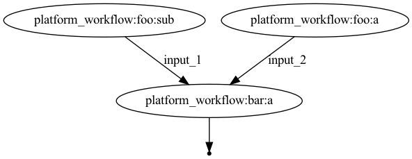

# DSL2 nextflow example

## to run:

`nextflow run pipeline.nf`

or

`nextflow run pipeline.nf -with-dag flowchart.png` to get a flow chart (doesn't always render perfectly with a complicated DSL2 pipeline)

## overview

This workflow does nothing of use. It's just a template to show how a potential `platform_workflow` can source other modules (i.e. `module-a` and `module-b`). These modules can have submodules for further organization.

`platform_workflow` calls `foo` workflow (`module-a`) which sources `module-a/submodule` to run process `sub` and process `a`. Output files from these are then passed to `bar` workflow (`module-b`) which publishes a file.

There is also a `potential-testing.nf` script which has an example test that could be used for `module-a`'s process `a`. I haven't found any official nextflow testing advice so this is just one way I've been thinking about testing.

This can be run with `nextflow run potential-testing.nf`

## caveates

* params/config namespace is shared across all modules so each module should have a unique namespace (e.g. params.module_a.*)
* I haven't figured a good way of including configs for submodules so the nextflow.config that loads by default (if this is the route you'd like to go) does not source other configs. Could leverage a CI/CD solution to find all (or specifically named) configs and concat together but that has its own problems...
    * can inline containers to use etc. at the process level